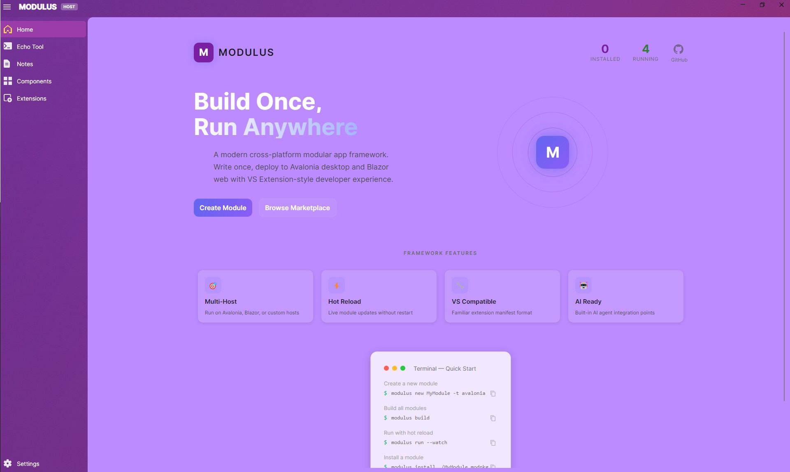
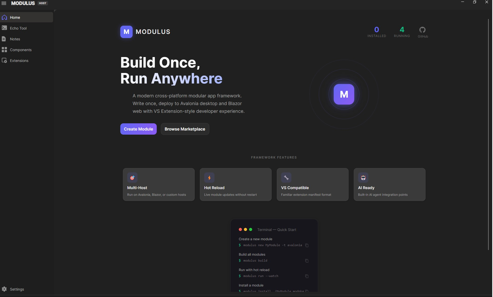
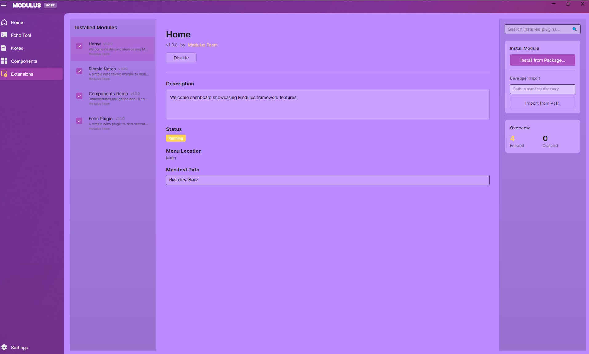

# Modulus

Modulus 是一个现代化的跨平台插件式应用框架，帮助开发者快速构建可扩展、可维护、支持 AI 的工具类软件。

## 🖼️ 界面截图

| Home (Light) | Home (Dark) |
|---|---|
|  |  |

### Module Manager



## ✨ 特性亮点

### 多主机架构
- **UI 无关核心**: 业务逻辑独立于任何 UI 框架
- **可插拔主机**: 支持 Avalonia (桌面) 和 Blazor Hybrid (MAUI)
- **共享核心逻辑**: 相同的 Domain/Application 代码运行在所有主机上

### 扩展系统
- **VS Extension 兼容**: 使用 `extension.vsixmanifest` (XML) 格式
- **热重载**: 基于 AssemblyLoadContext 的隔离，支持动态加载/卸载
- **显式安装**: 通过 CLI 或 UI 安装扩展，不自动扫描目录
- **类型安全入口点**: `ModulusPackage` 基类，类似 VS VsPackage

### 开发体验
- 扩展 SDK，支持声明式属性
- AI Agent 插件支持（可嵌入 LLM）
- 签名验证与版本控制
- 跨平台: Windows / macOS / Linux

## 🏗️ 架构

```
src/
├── Modulus.Core/              # 运行时、模块加载器、DI
├── Modulus.Sdk/               # SDK: ModulusPackage, 属性
├── Modulus.UI.Abstractions/   # UI 契约 (IMenuRegistry, INavigationService)
├── Hosts/
│   ├── Modulus.Host.Avalonia/ # Avalonia 桌面 (ID: Modulus.Host.Avalonia)
│   └── Modulus.Host.Blazor/   # Blazor Hybrid (ID: Modulus.Host.Blazor)
└── Modules/
    ├── EchoPlugin/            # 示例: Echo 插件
    ├── SimpleNotes/           # 示例: 笔记模块
    └── ComponentsDemo/        # 示例: UI 组件演示
```

## 📦 扩展结构

```
MyExtension/
├── extension.vsixmanifest     # XML 清单 (VS Extension 格式)
├── MyExtension.Core.dll       # 核心逻辑 (host-agnostic)
├── MyExtension.UI.Avalonia.dll
└── MyExtension.UI.Blazor.dll
```

## 🚀 快速开始

### 安装 CLI 和模板

```bash
# 安装 Modulus CLI
dotnet tool install -g Agibuild.Modulus.Cli

# 安装项目模板
dotnet new install Agibuild.Modulus.Templates
```

### 创建您的第一个模块

```bash
# 创建新模块
modulus new MyModule -t avalonia

# 或使用 dotnet new
dotnet new modulus-avalonia -n MyModule

# 进入模块目录
cd MyModule

# 编译模块
modulus build

# 打包分发
modulus pack

# 安装测试
modulus install ./output/MyModule-1.0.0.modpkg
```

### 运行主机

```bash
# 运行 Avalonia 主机
dotnet run --project src/Hosts/Modulus.Host.Avalonia

# 运行 Blazor 主机（仅 Windows）
dotnet run --project src/Hosts/Modulus.Host.Blazor
```

## 🛠️ CLI 工具

Modulus 提供全面的命令行工具用于模块开发和管理。

### 命令

| 命令 | 描述 |
|------|------|
| `modulus new <name>` | 创建新模块项目 |
| `modulus build` | 在当前目录编译模块 |
| `modulus pack` | 编译并打包为 .modpkg |
| `modulus install <source>` | 安装模块 |
| `modulus uninstall <name>` | 卸载模块 |
| `modulus list` | 列出已安装模块 |

### 创建模块

```bash
modulus new MyModule [options]

选项:
  -t, --target <avalonia|blazor>  目标主机平台
  -d, --display-name <name>       菜单中显示的名称
  -p, --publisher <name>          发布者名称
  -i, --icon <icon>               菜单图标
  --force                         覆盖已有文件
```

### 编译和打包

```bash
# 编译模块
modulus build

# 打包分发
modulus pack

# 打包选项
modulus pack -o ./dist --verbose
```

### 安装和管理

```bash
# 从 .modpkg 文件安装
modulus install ./MyModule-1.0.0.modpkg

# 从目录安装（开发用）
modulus install ./artifacts/bin/Modules/MyModule/

# 强制覆盖已有安装
modulus install ./MyModule-1.0.0.modpkg --force

# 卸载
modulus uninstall MyModule

# 列出已安装模块
modulus list --verbose
```

## 🔌 创建扩展

### 1. 创建项目

```bash
modulus new MyExtension -t avalonia
```

这将创建：
```
MyExtension/
├── MyExtension.sln
├── extension.vsixmanifest
├── MyExtension.Core/
│   ├── MyExtensionModule.cs
│   └── ViewModels/MainViewModel.cs
└── MyExtension.UI.Avalonia/
    ├── MyExtensionAvaloniaModule.cs
    └── MainView.axaml
```

### 2. 定义入口点

```csharp
// MyExtension.Core/MyExtensionModule.cs
public class MyExtensionModule : ModulusPackage
{
    public override void ConfigureServices(IModuleLifecycleContext context)
    {
        context.Services.AddSingleton<IMyService, MyService>();
        context.Services.AddTransient<MainViewModel>();
    }
}
```

### 3. 创建清单

清单由模板自动生成。关键部分：

```xml
<!-- extension.vsixmanifest -->
<?xml version="1.0" encoding="utf-8"?>
<PackageManifest Version="2.0.0" 
    xmlns="http://schemas.microsoft.com/developer/vsx-schema/2011">
  <Metadata>
    <Identity Id="your-guid" Version="1.0.0" Publisher="You" />
    <DisplayName>My Extension</DisplayName>
    <Description>My awesome extension</Description>
  </Metadata>
  <Installation>
    <InstallationTarget Id="Modulus.Host.Avalonia" Version="[1.0,)" />
    <InstallationTarget Id="Modulus.Host.Blazor" Version="[1.0,)" />
  </Installation>
  <Assets>
    <Asset Type="Modulus.Package" Path="MyExtension.Core.dll" />
    <Asset Type="Modulus.Package" Path="MyExtension.UI.Avalonia.dll" 
           TargetHost="Modulus.Host.Avalonia" />
    <Asset Type="Modulus.Menu" Id="my-menu" DisplayName="My Tool" 
           Icon="Home" Route="MyExtension.ViewModels.MainViewModel" />
  </Assets>
</PackageManifest>
```

### 4. 编译、打包和安装

```bash
cd MyExtension
modulus build
modulus pack
modulus install ./output/MyExtension-1.0.0.modpkg
```

## 📚 文档

- [快速入门指南](./docs/getting-started.zh-CN.md)
- [CLI 参考](./docs/cli-reference.md)
- [模块开发指南](./docs/module-development.md)
- [OpenSpec 规格说明](./openspec/specs/)
- [贡献指南](./CONTRIBUTING.zh-CN.md)

## 🏭 构建系统

项目使用 Nuke 进行构建自动化：

```bash
# 构建全部
nuke compile

# 运行测试
nuke test

# 打包模块
nuke pack-module

# 打包 CLI 模板
nuke pack-templates

# 发布 NuGet 包
nuke publish-libs
```

## 项目状态

- **阶段**: 活跃开发中
- **测试覆盖**: 30+ 测试通过
- **平台**: Windows, macOS, Linux

## NuGet 包

| 包 | 描述 |
|---|------|
| `Agibuild.Modulus.Sdk` | 模块开发 SDK |
| `Agibuild.Modulus.UI.Abstractions` | UI 契约和抽象 |
| `Agibuild.Modulus.UI.Avalonia` | Avalonia UI 组件 |
| `Agibuild.Modulus.UI.Blazor` | Blazor UI 组件 |
| `Agibuild.Modulus.Cli` | CLI 工具 |
| `Agibuild.Modulus.Templates` | 项目模板 |

> 说明：`modulus new` 会生成 `Directory.Build.props`，通过 `ModulusCliLibDir` 从 CLI 安装目录解析 `Modulus.*.dll`，确保新生成的模块可直接编译通过。

## 贡献

欢迎提交 Issue 和 PR！请参阅 [CONTRIBUTING.zh-CN.md](./CONTRIBUTING.zh-CN.md)。

## 许可证

[MIT License](./LICENSE)
