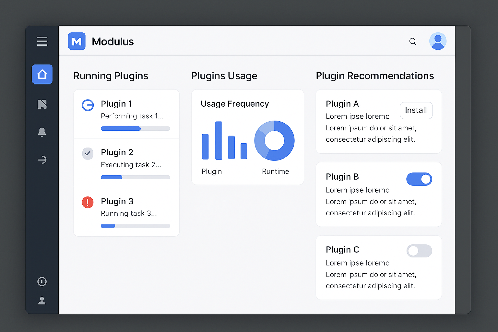

# Modulus Usage Guide

This guide provides an overview of how to use the Modulus application and its features.

## User Interface Overview

The Modulus interface is divided into several key areas:

1. **Main Navigation**: Access different sections of the application
2. **Plugin Area**: Where plugin content is displayed
3. **Toolbar**: Quick access to common actions
4. **Status Bar**: Shows application status and notifications

## Key Features

### Plugin Management

Modulus is built around plugins that extend its functionality. To manage plugins:

1. Go to **Settings > Plugins**
2. You'll see a list of installed plugins
3. Use the **Browse** button to find new plugins
4. Use **Enable/Disable** toggles to control which plugins are active
5. Click **Settings** on individual plugins to configure them

### Working with Projects

To create and manage projects:

1. Go to **File > New Project** or click the **New Project** button on the dashboard
2. Select a project template
3. Fill in the project details and click **Create**
4. Your project will appear in the **Recent Projects** list on the dashboard

To open an existing project:
1. Go to **File > Open Project** or click **Open** on the dashboard
2. Browse to your project file and select it

### Customizing the Interface

Modulus allows for extensive customization:

1. Go to **Settings > Appearance**
2. Choose between Light, Dark, or System theme
3. Adjust font size and type
4. Customize colors and accent settings
5. Rearrange panels by dragging and dropping their headers

### Using Plugins

Each plugin works slightly differently, but generally:

1. Select the plugin from the main navigation
2. The plugin's interface will load in the main area
3. Use the plugin's controls and features
4. Plugin-specific settings are available via the gear icon in the plugin's panel

## Common Tasks

### Configuring the Application

To customize general application settings:

1. Go to **Settings > General**
2. Configure startup behavior, language, and update settings
3. Adjust performance settings based on your hardware
4. Set default locations for projects and exports

### Creating and Using Templates

Templates help you start new projects quickly:

1. Go to **File > Templates > Manage Templates**
2. Click **New Template** to create a template from the current project
3. Give your template a name and description
4. To use a template, select it when creating a new project

### Importing and Exporting

To share your work:

1. Go to **File > Export** to export your project or data
2. Choose the export format (varies by plugin)
3. Select a destination and click **Export**

To import:
1. Go to **File > Import**
2. Select the file type and browse to your file
3. Follow the import wizard to complete the process

### Keyboard Shortcuts

Modulus supports numerous keyboard shortcuts to speed up your workflow:

- **Ctrl+N**: New project
- **Ctrl+O**: Open project
- **Ctrl+S**: Save
- **Ctrl+P**: Print
- **Ctrl+Tab**: Switch between open projects
- **F1**: Open help
- **Ctrl+,**: Open settings

View the full list at **Help > Keyboard Shortcuts**.

## Advanced Features

### Command Palette

Access any command quickly with the command palette:

1. Press **Ctrl+Shift+P** or go to **View > Command Palette**
2. Start typing the name of a command
3. Select from the filtered list of commands

### Scripting and Automation

For advanced users, Modulus supports scripting:

1. Go to **Tools > Scripts > Script Editor**
2. Create or edit scripts using the built-in editor
3. Run scripts with **Scripts > Run Script**
4. Schedule scripts via **Scripts > Schedule**

### Multi-Monitor Support

Modulus works well across multiple displays:

1. Go to **View > New Window** to create an additional view
2. Drag the new window to your second monitor
3. Each window can display different parts of your project

### Backing Up Your Work

Modulus automatically backs up your work, but you can also:

1. Go to **File > Backup > Create Backup**
2. Choose what to include in the backup
3. Select a location for the backup file

To restore from a backup:
1. Go to **File > Backup > Restore**
2. Browse to your backup file
3. Follow the restoration wizard

## Troubleshooting

If you encounter issues while using Modulus:

1. Check the [Troubleshooting Guide](./troubleshooting.md)
2. Look for error messages in **Help > View Logs**
3. Try restarting the application
4. Disable recently installed plugins to identify conflicts

For more detailed help, visit our community forum or submit an issue on GitHub.
