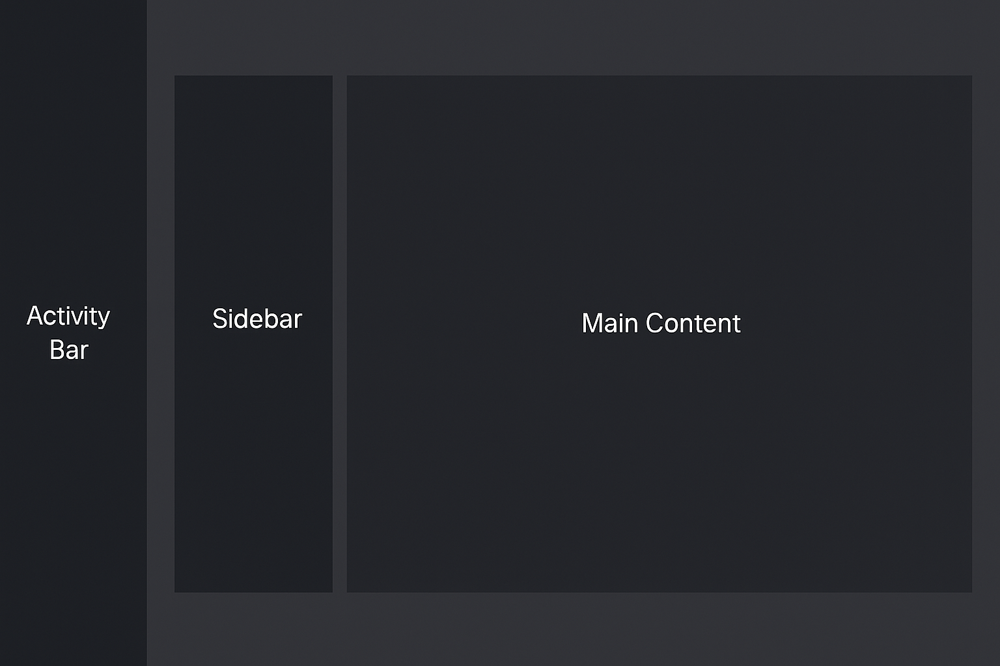
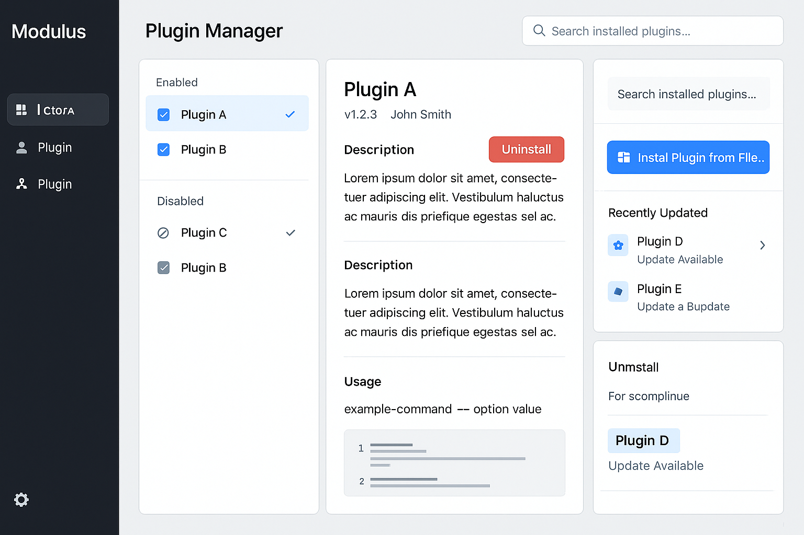

# Modulus 系统架构

本文档概述了 Modulus 插件系统的架构设计，解释了核心组件、交互和设计决策。

## 架构概述

Modulus 采用基于插件的架构，主应用程序作为各个插件的宿主环境。系统设计旨在提供灵活性、隔离性和集成性之间的平衡。



## 核心组件

### 1. 主应用程序 (Modulus.App)

主机应用程序提供运行时环境、用户界面框架和核心服务。其职责包括：

- 插件发现和加载
- 服务注册和依赖注入
- 配置管理
- UI 集成和布局管理
- 横切关注点（日志记录、安全性等）

### 2. 插件宿主 (Modulus.PluginHost)

插件宿主管理插件生命周期并提供隔离。其职责包括：

- 通过 AssemblyLoadContext 加载插件
- 版本兼容性检查
- 资源隔离
- 插件生命周期管理（初始化、启动、停止、卸载）

### 3. 插件契约 (Modulus.Plugin.Abstractions)

契约库定义了插件必须实现的接口和抽象。主要组件包括：

- `IPlugin`：所有插件必须实现的主要接口
- `IPluginMeta`：插件元数据接口
- `ILocalizer`：本地化支持接口
- 服务抽象和扩展点

### 4. 插件

插件是独立开发的模块，用于扩展主应用程序的功能。每个插件：

- 实现 `IPlugin` 接口
- 拥有自己的资源目录
- 可以提供 UI 组件、服务或两者
- 管理自己的依赖关系

## 设计原则

该架构遵循以下关键原则：

1. **隔离**：插件在隔离环境中运行，以防止级联故障并允许独立的生命周期管理。

2. **基于契约的集成**：插件和主机之间的所有交互都通过明确定义的契约进行。

3. **配置优于约定**：系统行为通过显式配置控制，而非隐含约定。

4. **依赖注入**：服务通过中央 DI 容器注册和解析。

5. **自适应 UI 集成**：插件可以贡献适应主应用程序主题和布局的 UI 组件。

## 插件生命周期



1. **发现**：主机扫描插件目录以查找潜在插件。
2. **加载**：插件程序集被加载到隔离的上下文中。
3. **验证**：主机验证插件实现了所需接口并且版本兼容。
4. **注册**：插件服务注册到 DI 容器。
5. **初始化**：插件使用所需服务进行初始化。
6. **执行**：插件运行并与系统交互。
7. **卸载**：当不再需要插件或应用程序关闭时，插件被优雅地卸载。

## 项目结构

```
src/
  ├── Modulus.App/                   # 主应用程序
  ├── Modulus.App.Desktop/           # 桌面平台集成
  ├── Modulus.Plugin.Abstractions/   # 插件契约定义
  ├── Modulus.PluginHost/            # 插件加载和生命周期管理
  ├── samples/                       # 示例插件
  │   ├── ExamplePlugin/
  │   ├── NavigationExamplePlugin/
  │   └── SimplePlugin/
  └── tools/                         # 开发工具
      ├── modulus-app/               # 主应用程序模板
      └── modulus-plugin/            # 插件模板
```

## 服务架构

服务架构使用分层 DI 容器方法：

1. **根容器**：包含应用程序范围的服务。
2. **插件容器**：每个插件都有一个作用域为其生命周期的子容器。

这种设计允许插件：
- 访问根容器中的共享服务
- 在自己的作用域内注册和覆盖服务
- 保持与其他插件的服务注册隔离

## 配置系统

配置遵循分层方法：

1. **应用程序配置**：应用程序的基本设置。
2. **插件配置**：特定于每个插件的设置。
3. **用户配置**：用户特定的覆盖。
4. **运行时配置**：运行时应用的动态设置。

配置源在运行时合并，具有明确的优先级顺序。

## 插件安全

安全措施包括：

1. **程序集隔离**：插件在单独的程序集加载上下文中运行。
2. **资源边界**：插件对系统资源的访问受限。
3. **服务访问控制**：服务可以实现访问控制以限制操作。
4. **沙箱**：为不受信任的插件提供可选的沙箱环境。

## 性能考虑

该架构包括几项性能优化：

1. **懒加载**：插件按需加载。
2. **程序集修剪**：通过修剪未使用的代码减小程序集大小。
3. **资源缓存**：共享资源被缓存以减少内存使用。
4. **卸载**：插件可以被卸载以释放资源。

## 扩展点

系统提供以下主要扩展点：

1. **服务**：插件可以注册和使用服务。
2. **UI 组件**：插件可以为主视图或导航提供 UI 组件。
3. **命令**：插件可以注册出现在菜单和工具栏中的命令。
4. **设置**：插件可以为应用程序设置做出贡献。

## 未来考虑

计划的架构增强：

1. **插件市场**：支持从远程源发现和安装插件。
2. **增强沙箱**：对插件功能进行更细粒度的控制。
3. **热模块替换**：无需重启应用程序即可更新插件。
4. **跨插件通信**：插件之间的标准化消息传递。
